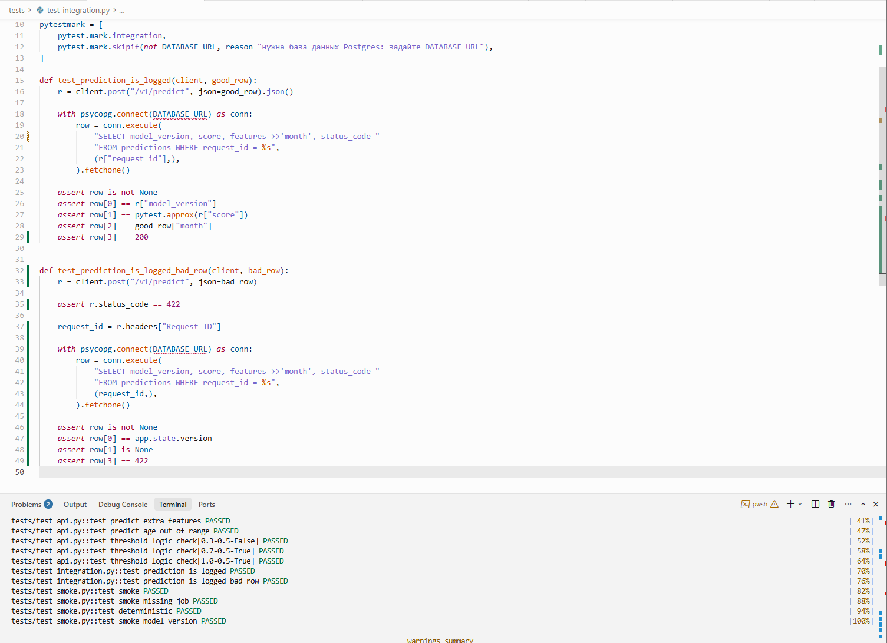
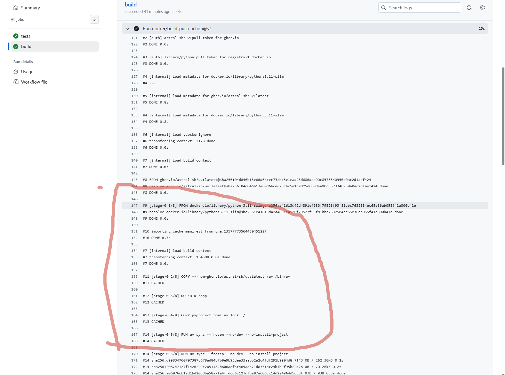

## Основные моменты процесса 

### Сломанный тест и свой test_integration

В начале добавил в ci.yml только тесты, добавив свой интеграционный тест, который проверяет status_code (при корректном выполнении и при ошибке валидации). Для этого сначала добавил вывод status_code в свой код (почему-то вообще не увидел, что его надо добавлять, в предыдущей домашке) при успешном запросе и при ошибке валидации. [Ссылка](https://github.com/Fetis789/BankMarketingPetModel/actions/runs/36265350445/job/108468856079?pr=6) на первый прогон с моим прошедшим test_integration. Также прикладываю скрин с прошедшим локально тестом:

Также прикладываю ссылку на [pull request](https://github.com/Fetis789/BankMarketingPetModel/pull/11), в котором сначала сломал тест, потом починил. Этот request сделал уже после финального deploy, но тест сломал еще в самом начале вот [тут](https://github.com/Fetis789/BankMarketingPetModel/pull/5), просто тупанул и только сейчас увидел, что сломать и починить надо в одном и том же pull request.

### Сделанный пайплайн с особенностями моего сервиса.
Прикрепляю [первый прогон](https://github.com/Fetis789/BankMarketingPetModel/actions/runs/36329137717) со времи тремя выполненными джобами с моими параметрами (интеграционный тест, путь к модели, который выдается в healthy и свой smoke test). Также прикрепляю [страницу](https://github.com/Fetis789/BankMarketingPetModel/pkgs/container/bankmarketingpetmodel) с собранным пакетом. На странице есть история всех коммитов, на которых собирался и публиковался образ. Сборка, которую прикрепил выше, соответствует коммиту sha-ad7b55ebb366e82da54d03d1b7cbeefb9a2f3a01.

### Три поломки с красным прогоном

1. Неправильный путь к модели в configmap
Ссылки на [сломанный action](https://github.com/Fetis789/BankMarketingPetModel/actions/runs/36340516528) и [починенный action](https://github.com/Fetis789/BankMarketingPetModel/actions/runs/36341261200). Тут стоит отметить, что по логам сломанного action вообще непонятно, в чем проблема. Видно только, что проблема на этапе сборки сервиса, но более глубоко не видно (просто ошибка с exit code 1). При этом есть 3 пода сервиса - 2 в статусе ImagePullBackOff и 1 в статусе Running с 5 рестартами. И еще 1 корректно собранный под с postgres (что логично, он собирается раньше и не зависит от модели)

2. Неправильное имя secret
Ссылки на [сломанный action](https://github.com/Fetis789/BankMarketingPetModel/actions/runs/36342091664) и [починенный action](https://github.com/Fetis789/BankMarketingPetModel/actions/runs/36342605375). Ошибка также в пункте "сервис", но теперь она понятнее из-за статуса CreateContainerConfigError в одном из подов сервиса. Сразу понятно, что что-то с конфигом.

3. Ресурсы
Ссылки на [сломанный action](https://github.com/Fetis789/BankMarketingPetModel/actions/runs/36342983120) и [починенный action](https://github.com/Fetis789/BankMarketingPetModel/actions/runs/36345040838). Ошибка все также в поле сервис, но теперь три ноды сервиса уже все в pending, что как раз и указывает на нехватку ресурсов. 

Отдельно замечу, что во всех трех ошибках видим три пода с сервисом (хотя у нас должно быть всего 2 реплики). Происходит это из-за того, что в процессе работы кластера мы меняем образ пода и делаем rollout. В таком случае kubernetes может какое-то время обеспечить 25% лишних реплик (параметр max_surge) на поды со старым образом. Эти поды быстро удалятся при успешном запуске, но при ошибках они висят в определенном статусе и поэтому мы видим их на диагностике. У двух подов из трех одинаковый префикс, а значит они были собраны по одному шаблону и, как следствие, одному образу. 

## Ответы на семь вопросов

### Вопрос 1

В [Первом прогоне](https://github.com/Fetis789/BankMarketingPetModel/actions/runs/36248531616/job/108422211066) job шел 1 минуту 27 секунд. Во [втором прогоне](https://github.com/Fetis789/BankMarketingPetModel/actions/runs/36265422479/job/108469159328) job шел 44 секунды. Там закешировалась загрузка образа python:3, uv, копирование pyproject.toml и uv.lock, а также установка зависимостей (собственно, в том числе для этого мы делали два uv sync). Данные слои взяты в кэш, так как они никак не меняют внутреннее состояние рабочей среды докера и находятся в начале Dockerfile (перед RUN, которые как-то меняют среду). pyproject.toml и uv.lock не меняются, как и сторонние зависимости, не относящиеся к проекту

Скрин с закешированными частями:

### Вопрос 2
У меня с текущим кодом не видны ImagePullBackOff в статусах подов при успешном проходе (я включил вывод их статусов в пайплайн в диагностике при успешном проходе). Предположу,что они могут возникнуть в какой-то момент прохода пайплайна из-за того, что мы делаем команду kubectl set image deploy/bank-service api="$IMAGE" после apply -f k8s/ (у которого образ лежит в deployment.yml) и меняем один образ на другой.

### Вопрос 3
Секрет из GITHUB сначала в ci.yml помещается в env runnerа. Затем в runnerе командой kubectl create secret generic bank-secrets мы передаем его в кластер. Его обработка в кластере настроена в файле postgres.yml в строке secretKeyRef: {name: bank-secrets, key: POSTGRES_PASSWORD}. Там ее уже видит postgres и использует при инициализации. В ConfigMap пароль класть нельзя, так как ConfigMap остается в коде при пуше в github, и любой пользователь в таком случае может узнать этот пароль. Сейчас мы создаем тестовый кластер, который сразу умирает после проверки, поэтому это наверно не так критично, но вот когда будем привязывать к github actions локальный кластер, это уже опасно.

### Вопрос 4
В теущей конфигурации случится ситуация, в которой при push в main джобы test и build стартанут параллельно. При этом test может быть неуспешной и в то же время образ после build загрузится в ghcr и в итоге в deploy (как и в ветке main) будет некорректно работающий сервис.

### Вопрос 5
Это происходит из-за поля 
on: 
  push: {branches: [main]}
  pull_request:

в начале ci.yml файла и полей if: github.ref == 'refs/heads/main' в build и needs: build в deploy. Эти поля приводят к следующей ситуации: джоба test запускается при любом pull_request (даже не в ветку main), а также при push в main. Джоба build при этом из-за условия if запускается только на ветке main. Соответственно, она не запускается при pull request из другой ветки в ветку main, и запускается только при push в main. Аналогично в силу условия needs: build ведет себя и джоба deploy. Предполагаю, что данная стратегия сделана для того, чтобы публикация контейнера в build не публиковалась во внешнее хранилище при каждом Pull Request.

### Вопрос 6
В данном случае имеются ввиду две реплики сервиса, которые могут одновременно обратиться с созданием таблицы в ОДНУ реплику базы данных. Это (с небольшой вероятностью в случае, если оба пода прям в одно время сделают init) может привести к ошибки на одном из подов и его придется перезапускать. Для этого сделана команда pg_advisory_xact_lock, чтобы исполнение команды init() на одном поде блокировало обращение другого.

### Вопрос 7
При ошибках было три статуса - Pending, ImagePullBackOff, CreateContainerConfigError. Pending идет первым. В процессе Pending scheduler ищет и подготавливает поды к запуску. Здесь он не смог обеспечить нужные ресурсы и подвис. Затем обычно идет ImagePullBackOff. В случае него под уже назначен узлу и kubernetes устанавливает на поды нужные image. CreateContainerConfigError обычно возникает уже после скачивания image и привязки его к pod. В этом процессе kubelet пытается сформировать конфигурацию контейнера с учетом image и падает, если в конфигах ошибки.
